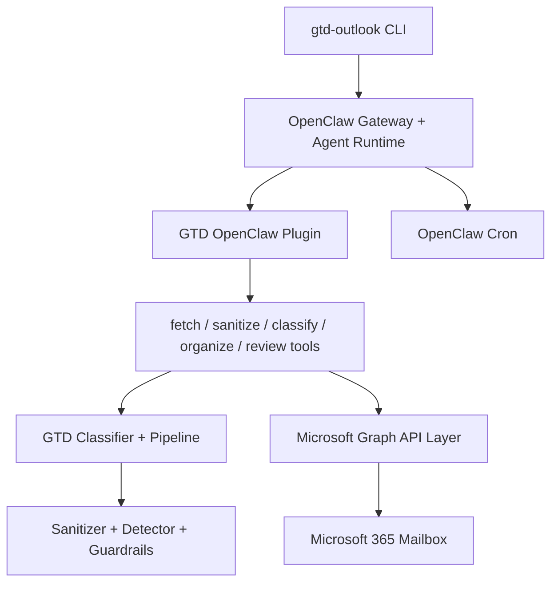

# GTD for Outlook

[English version](README.md)

GTD for Outlook e uma CLI Node.js open source e um plugin OpenClaw que organiza uma caixa de email Microsoft 365 usando a metodologia Getting Things Done, de David Allen.

O projeto le emails do Outlook por meio do Microsoft Graph, classifica mensagens em categorias GTD, move ou categoriza essas mensagens, e pode executar pelo OpenClaw para orquestracao por agentes, classificacao LLM somente em JSON e processamento agendado da caixa de entrada.

## Status

`v0.1.0` esta pronto para handoff de producao, antes da publicacao da tag. Os modulos principais de seguranca, GTD, pipeline, Microsoft Graph, plugin OpenClaw e CLI estao implementados e cobertos por testes. A acao restante de release documentada no backlog e a publicacao final da tag.

Veja [docs/BACKLOG.md](docs/BACKLOG.md), [docs/plan.md](docs/plan.md) e [docs/RELEASE_HANDOFF_V0.1.0.md](docs/RELEASE_HANDOFF_V0.1.0.md) para o gate atual e o checklist de release.

## O Que Ele Faz

- Classifica emails em categorias GTD: `@Action`, `@WaitingFor`, `@SomedayMaybe`, `@Reference` e `Archive`
- Usa integracao direta com Microsoft Graph usando permissao delegada `Mail.ReadWrite`
- Trata corpos de email como entrada nao confiavel e aplica defesas em camadas contra prompt injection
- Executa classificacao por meio do `llm-task` do OpenClaw como uma fronteira somente JSON e sem ferramentas
- Suporta processamento em lotes, checkpoints, triagem por metadados e deduplicacao por hash de conteudo para caixas maiores
- Fornece ferramentas de plugin OpenClaw para buscar, sanitizar, classificar, organizar e gerar revisao semanal
- Fornece comandos CLI para setup, processamento, inspecao de cache, status, revisao e agendamento

## Arquitetura



Decisoes principais:

- OpenClaw e a camada de orquestracao porque fornece ferramentas de plugin, sessoes de agente, `llm-task` e agendamento via cron. Veja [ADR 001](docs/adr/001-openclaw-orchestration.md).
- Microsoft Graph e chamado diretamente, em vez de usar um servidor MCP comunitario, para ter mais controle sobre autenticacao, paginacao, tratamento de erros e cache de tokens. Veja [ADR 002](docs/adr/002-direct-graph-api.md).

## Pre-requisitos

- Node.js 22+
- npm
- OpenClaw CLI instalado e autenticado
- Caixa de email Microsoft 365
- Azure App Registration com permissao delegada Microsoft Graph `Mail.ReadWrite`

Siga [docs/microsoft-graph-setup.md](docs/microsoft-graph-setup.md) para criar o Azure App Registration. O MVP usa autenticacao delegada por device code e nao exige client secret.

## Instalar O Projeto

Clone o repositorio, instale as dependencias fixadas e compile a saida TypeScript:

```bash
git clone https://github.com/luizgama/gtd-for-outlook.git
cd gtd-for-outlook
npm ci
npm run build
```

Para usar a CLI localmente a partir deste checkout, execute a entrada compilada diretamente:

```bash
node dist/index.js --help
```

ou vincule o pacote para disponibilizar `gtd-outlook` no seu PATH:

```bash
npm link
gtd-outlook --help
```

## Configurar Microsoft Graph

A CLI pode armazenar configuracoes do Graph no arquivo local de configuracao da aplicacao em `~/.gtd-outlook/`:

```bash
gtd-outlook setup --client-id <azure-application-client-id> --tenant-id <tenant-id-or-common>
```

Voce tambem pode executar `gtd-outlook setup` de forma interativa.

Para execucao do plugin OpenClaw, o runtime do plugin atualmente le credenciais do Graph a partir de variaveis de ambiente. Exporte essas variaveis no shell ou no ambiente de servico que executa o gateway OpenClaw:

```bash
export GRAPH_CLIENT_ID=<azure-application-client-id>
export GRAPH_TENANT_ID=<tenant-id-or-common>
```

Log opcional de requisicoes Graph para a camada de configuracoes da CLI:

```bash
export LOG_GRAPH_API_TO_FILE=true
export LOG_GRAPH_API_FILE_PATH=/tmp/gtd-for-outlook/graph-api.log
```

## Instalar O Plugin OpenClaw

Compile primeiro, porque `src/plugin/index.js` conecta o OpenClaw a entrada compilada `dist/plugin/index.js`:

```bash
npm run build
```

Instale o diretorio local do plugin que contem `src/plugin/openclaw.plugin.json`:

```bash
openclaw plugins install --link ./src/plugin --force
openclaw plugins enable gtd-outlook
openclaw plugins registry --refresh --json
openclaw plugins inspect gtd-outlook --json --runtime
```

A inspecao de runtime deve mostrar `status: loaded` e estas ferramentas:

- `gtd_fetch_emails`
- `gtd_classify_email`
- `gtd_organize_email`
- `gtd_sanitize_content`
- `gtd_weekly_review`

Habilite `llm-task` e permita as ferramentas GTD para o perfil ativo do agente:

```bash
openclaw config set plugins.entries.llm-task.enabled true
openclaw config unset tools.allow
openclaw config set tools.alsoAllow '["gtd_fetch_emails","gtd_classify_email","gtd_organize_email","gtd_sanitize_content","gtd_weekly_review","llm-task"]' --strict-json
```

Valide o que o agente `main` pode chamar:

```bash
openclaw gateway call tools.catalog --json --params '{"agentId":"main"}'
openclaw gateway call tools.effective --json --params '{"agentId":"main","sessionKey":"agent:main:main"}'
```

Use [openclaw/AGENTS.md](openclaw/AGENTS.md) como contrato de comportamento do orquestrador GTD para o agente `main`.

## Executar

Execute pelo runtime de agente do OpenClaw:

```bash
gtd-outlook process --agent
```

Execute um smoke test manual pelo OpenClaw:

```bash
openclaw agent --agent main --message "Process my inbox using GTD. Use gtd_fetch_emails, then gtd_classify_email for each email, then gtd_organize_email. Return a compact summary." --session-id gtd-orchestrator-smoke --json --timeout 180
```

Crie um job recorrente de processamento da caixa de entrada:

```bash
gtd-outlook schedule --every 30m
```

Se sua versao do OpenClaw exigir nomes explicitos para jobs cron, use o OpenClaw diretamente:

```bash
openclaw cron add --name gtd-outlook-inbox --every 30m --agent main --message "Run GTD inbox process command." --session isolated --json
```

## Referencia Da CLI

```bash
gtd-outlook setup                         # Armazena client e tenant do Azure Graph
gtd-outlook process                       # Imprime o payload de processamento usando configuracoes locais
gtd-outlook process --agent               # Roteia o processamento pelo runtime de agente OpenClaw
gtd-outlook process --batch-size 100      # Processa 100 emails por lote
gtd-outlook process --max-emails 500      # Limita o total de emails nesta execucao
gtd-outlook process --max-llm-calls 300   # Limita chamadas LLM nesta execucao
gtd-outlook process --since 2026-05-01    # Processa emails desde uma data especifica
gtd-outlook process --backlog             # Habilita modo de backlog para primeira migracao
gtd-outlook capture                       # Executa a etapa de captura via OpenClaw
gtd-outlook clarify                       # Executa a etapa de clarificacao via OpenClaw
gtd-outlook organize                      # Executa a etapa de organizacao via OpenClaw
gtd-outlook review                        # Gera resumo de revisao semanal
gtd-outlook cache stats                   # Mostra metricas do cache local de classificacao
gtd-outlook cache clear                   # Limpa o arquivo local de cache de classificacao
gtd-outlook status                        # Mostra status do gateway OpenClaw e do cron
gtd-outlook schedule --every 30m          # Adiciona processamento recorrente via cron do OpenClaw
```

## Modelo De Seguranca

Conteudo de email e entrada nao confiavel. O caminho de classificacao foi desenhado com controles em camadas:

1. Sanitizacao estrutural antes do uso por LLM
2. Deteccao de prompt injection em entradas multilingues
3. Classificacao somente JSON por meio do `llm-task` do OpenClaw
4. Sem acesso a ferramentas dentro da fronteira LLM de classificacao
5. Validacao com schema TypeBox para saidas LLM e parametros de ferramentas
6. Guardrails pos-classificacao antes de acoes de organizacao

Veja [docs/specs/06-prompt-injection.md](docs/specs/06-prompt-injection.md) para o design detalhado de seguranca.

## Desenvolvimento

```bash
npm ci
npm run build
npm run lint
npm test
npm audit
```

As regras de desenvolvimento estao documentadas em [docs/AGENTS.md](docs/AGENTS.md). Os padroes importantes sao TypeScript ESM, Node.js 22+, versoes exatas de dependencias, `npm ci`, scripts postinstall desabilitados e testes para mudancas de comportamento.

## Documentacao Do Projeto

- [docs/ARCHITECTURE.md](docs/ARCHITECTURE.md): arquitetura detalhada
- [docs/PRODUCTION_HANDOFF_RUNBOOK.md](docs/PRODUCTION_HANDOFF_RUNBOOK.md): procedimento operacional de instalacao e validacao
- [docs/openclaw-agent-reference.md](docs/openclaw-agent-reference.md): troubleshooting de plugin OpenClaw, ferramentas, `llm-task` e cron
- [docs/EXECUTION_MAP.md](docs/EXECUTION_MAP.md): sequenciamento de implementacao e interfaces
- [docs/FUTURE_FEATURES.md](docs/FUTURE_FEATURES.md): roadmap pos-v0.1.0
- [docs/CONTRIBUTING.md](docs/CONTRIBUTING.md): guia de contribuicao

## Roadmap

Itens planejados apos `v0.1.0` incluem suporte a multiplos provedores de email, adaptadores de servidor MCP, dashboard web, notificacoes mobile, suporte a caixas compartilhadas, regras GTD customizadas, integracao com calendario, notificacoes de mudanca do Graph e um pipeline extensivel de plugins de sanitizacao. Veja [docs/FUTURE_FEATURES.md](docs/FUTURE_FEATURES.md).

## Licenca

MIT. Veja [LICENSE](LICENSE).
