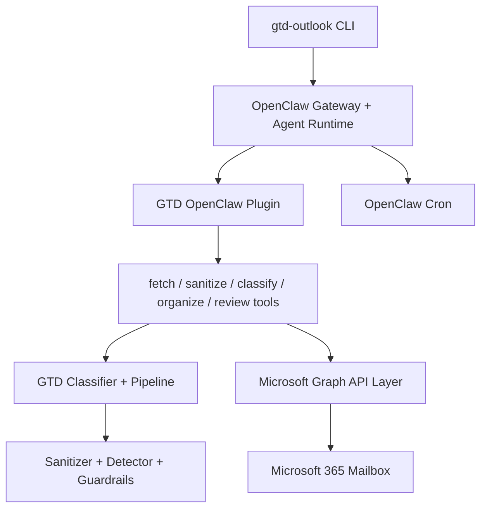

# GTD for Outlook

[Versao em Portugues do Brasil](README-ptbr.md)

GTD for Outlook is an open-source Node.js CLI and OpenClaw plugin that organizes a Microsoft 365 mailbox using David Allen's Getting Things Done methodology.

The project reads Outlook mail through Microsoft Graph, classifies messages into GTD buckets, moves or categorizes them, and can run through OpenClaw for agent orchestration, JSON-only LLM classification, and scheduled inbox processing.

## Status

`v0.1.0` is production-handoff ready, pre-tag. Core security, GTD, pipeline, Microsoft Graph, OpenClaw plugin, and CLI modules are implemented and covered by tests. The remaining release action documented in the backlog is final tag publication.

See [docs/BACKLOG.md](docs/BACKLOG.md), [docs/plan.md](docs/plan.md), and [docs/RELEASE_HANDOFF_V0.1.0.md](docs/RELEASE_HANDOFF_V0.1.0.md) for the current gate and release checklist.

## What It Does

- Classifies email into GTD categories: `@Action`, `@WaitingFor`, `@SomedayMaybe`, `@Reference`, and `Archive`
- Uses direct Microsoft Graph integration with delegated `Mail.ReadWrite`
- Treats email bodies as untrusted input and applies multi-layer prompt injection defenses
- Runs classification through OpenClaw `llm-task` as a JSON-only, no-tools boundary
- Supports batching, checkpoints, metadata triage, and content-hash deduplication for larger inboxes
- Provides OpenClaw plugin tools for fetch, sanitize, classify, organize, and weekly review
- Provides CLI commands for setup, processing, cache inspection, status checks, review, and scheduling

## Architecture



Key decisions:

- OpenClaw is the orchestration layer because it provides plugin tools, agent sessions, `llm-task`, and cron scheduling. See [ADR 001](docs/adr/001-openclaw-orchestration.md).
- Microsoft Graph is called directly instead of through a community MCP server for tighter auth, pagination, error handling, and token-cache control. See [ADR 002](docs/adr/002-direct-graph-api.md).

## Prerequisites

- Node.js 22+
- npm
- OpenClaw CLI installed and authenticated
- Microsoft 365 mailbox
- Azure App Registration with delegated Microsoft Graph `Mail.ReadWrite`

Follow [docs/microsoft-graph-setup.md](docs/microsoft-graph-setup.md) to create the Azure App Registration. The MVP uses delegated device-code authentication and does not require a client secret.

## Install The Project

Clone, install pinned dependencies, and build the TypeScript output:

```bash
git clone https://github.com/luizgama/gtd-for-outlook.git
cd gtd-for-outlook
npm ci
npm run build
```

For local CLI use from this checkout, either run the built entry directly:

```bash
node dist/index.js --help
```

or link the package so `gtd-outlook` is available on your PATH:

```bash
npm link
gtd-outlook --help
```

## Configure Microsoft Graph

The CLI can store Graph settings in the local app config file under `~/.gtd-outlook/`:

```bash
gtd-outlook setup --client-id <azure-application-client-id> --tenant-id <tenant-id-or-common>
```

You can also run `gtd-outlook setup` interactively.

For OpenClaw plugin execution, the plugin runtime currently reads Graph credentials from environment variables. Export them in the shell or service environment that runs the OpenClaw gateway:

```bash
export GRAPH_CLIENT_ID=<azure-application-client-id>
export GRAPH_TENANT_ID=<tenant-id-or-common>
```

## Install The OpenClaw Plugin

Build first, because `src/plugin/index.js` bridges OpenClaw to the compiled `dist/plugin/index.js` entry:

```bash
npm run build
```

Install the local plugin directory that contains `src/plugin/openclaw.plugin.json`:

```bash
openclaw plugins install --link ./src/plugin --force
openclaw plugins enable gtd-outlook
openclaw plugins registry --refresh --json
openclaw plugins inspect gtd-outlook --json --runtime
```

The runtime inspection should show `status: loaded` and these tools:

- `gtd_fetch_emails`
- `gtd_classify_email`
- `gtd_organize_email`
- `gtd_sanitize_content`
- `gtd_weekly_review`

Enable `llm-task` and allow the GTD tools for the active agent profile:

```bash
openclaw config set plugins.entries.llm-task.enabled true
openclaw config unset tools.allow
openclaw config set tools.alsoAllow '["gtd_fetch_emails","gtd_classify_email","gtd_organize_email","gtd_sanitize_content","gtd_weekly_review","llm-task"]' --strict-json
```

Validate what the `main` agent can call:

```bash
openclaw gateway call tools.catalog --json --params '{"agentId":"main"}'
openclaw gateway call tools.effective --json --params '{"agentId":"main","sessionKey":"agent:main:main"}'
```

Use [openclaw/AGENTS.md](openclaw/AGENTS.md) as the GTD orchestrator behavior contract for the `main` agent.

## Run It

Run through the OpenClaw agent runtime:

```bash
gtd-outlook process --agent
```

Run a manual OpenClaw smoke test:

```bash
openclaw agent --agent main --message "Process my inbox using GTD. Use gtd_fetch_emails, then gtd_classify_email for each email, then gtd_organize_email. Return a compact summary." --session-id gtd-orchestrator-smoke --json --timeout 180
```

Create a recurring inbox-processing job:

```bash
gtd-outlook schedule --every 30m
```

If your OpenClaw version requires explicit cron job names, use OpenClaw directly:

```bash
openclaw cron add --name gtd-outlook-inbox --every 30m --agent main --message "Run GTD inbox process command." --session isolated --json
```

## CLI Reference

```bash
gtd-outlook setup                         # Store Azure Graph client and tenant settings
gtd-outlook process                       # Print process payload using local settings
gtd-outlook process --agent               # Route processing through OpenClaw agent runtime
gtd-outlook process --batch-size 100      # Process 100 emails per batch
gtd-outlook process --max-emails 500      # Cap total emails for this run
gtd-outlook process --max-llm-calls 300   # Cap LLM calls for this run
gtd-outlook process --since 2026-05-01    # Process emails since a given date
gtd-outlook process --backlog             # Enable first-time backlog mode
gtd-outlook capture                       # Run capture stage through OpenClaw
gtd-outlook clarify                       # Run clarify stage through OpenClaw
gtd-outlook organize                      # Run organize stage through OpenClaw
gtd-outlook review                        # Generate weekly review summary
gtd-outlook cache stats                   # Show local classification cache metrics
gtd-outlook cache clear                   # Clear local classification cache file
gtd-outlook status                        # Show OpenClaw gateway and cron status
gtd-outlook schedule --every 30m          # Add recurring OpenClaw cron processing
```

## Security Model

Email content is untrusted input. The classification path is designed around layered controls:

1. Structural sanitization before LLM use
2. Prompt injection detection across multilingual input
3. JSON-only classification through OpenClaw `llm-task`
4. No tool access inside the classification LLM boundary
5. TypeBox schema validation for LLM outputs and tool parameters
6. Post-classification guardrails before organize actions

See [docs/specs/06-prompt-injection.md](docs/specs/06-prompt-injection.md) for the detailed security design.

## Development

```bash
npm ci
npm run build
npm run lint
npm test
npm audit
```

Development rules are documented in [docs/AGENTS.md](docs/AGENTS.md). The important defaults are TypeScript ESM, Node.js 22+, exact dependency versions, `npm ci`, disabled postinstall scripts, and tests for behavior changes.

## Project Docs

- [docs/ARCHITECTURE.md](docs/ARCHITECTURE.md): detailed architecture
- [docs/PRODUCTION_HANDOFF_RUNBOOK.md](docs/PRODUCTION_HANDOFF_RUNBOOK.md): operator install and validation procedure
- [docs/openclaw-agent-reference.md](docs/openclaw-agent-reference.md): OpenClaw plugin, tool, `llm-task`, and cron troubleshooting
- [docs/EXECUTION_MAP.md](docs/EXECUTION_MAP.md): implementation sequencing and interfaces
- [docs/FUTURE_FEATURES.md](docs/FUTURE_FEATURES.md): post-v0.1.0 roadmap
- [docs/CONTRIBUTING.md](docs/CONTRIBUTING.md): contribution guidelines

## Roadmap

Post-v0.1.0 roadmap items include multi-provider email support, MCP server adapters, a web dashboard, mobile notifications, shared mailbox support, custom GTD rules, calendar integration, Graph change notifications, and an extensible sanitizer plugin pipeline. See [docs/FUTURE_FEATURES.md](docs/FUTURE_FEATURES.md).

## License

MIT. See [LICENSE](LICENSE).
