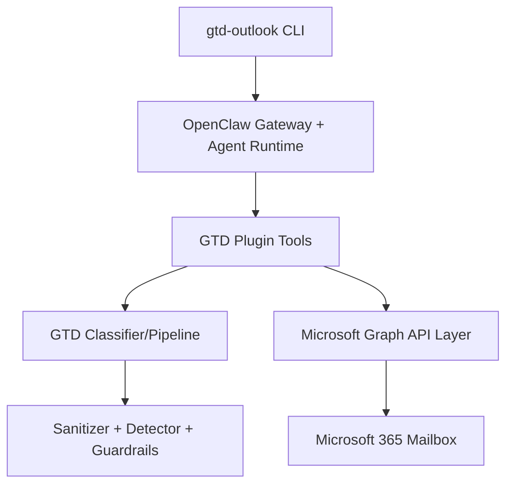

# GTD for Outlook

A CLI tool that organizes your Microsoft 365 mailbox using the **Getting Things Done (GTD)** methodology, orchestrated by the **OpenClaw** AI agent framework.

## Features

- **Automated email classification** using GTD methodology (Capture, Clarify, Organize, Reflect, Engage)
- **Multi-layer prompt injection defense** — emails are untrusted input processed safely in any language
- **Volume processing** — handles thousands of emails via batching, checkpointing, metadata triage, and content-hash deduplication
- **Persistent scheduling** — automatic inbox processing via OpenClaw cron
- **Token caching** — authenticate once, run unattended

## Status

**Production handoff ready (pre-tag)** — core security/GTD/pipeline/plugin/CLI modules are implemented and test-covered, with release validation and operator runbooks prepared. Remaining release action is final tag publication.

See [docs/BACKLOG.md](docs/BACKLOG.md) for the full task list and [docs/plan.md](docs/plan.md) for the implementation plan.

## Production Handoff

For production installation, OpenClaw setup, and real inbox validation, use:

- [docs/PRODUCTION_HANDOFF_RUNBOOK.md](docs/PRODUCTION_HANDOFF_RUNBOOK.md)
- [docs/RELEASE_HANDOFF_V0.1.0.md](docs/RELEASE_HANDOFF_V0.1.0.md)
- [docs/openclaw-agent-reference.md](docs/openclaw-agent-reference.md)

## Prerequisites

- Node.js 22+
- A Microsoft 365 account
- An Azure App Registration with `Mail.ReadWrite` permissions

## Quick Start

```bash
# Clone and install
git clone https://github.com/luizgama/gtd-for-outlook.git
cd gtd-for-outlook
npm ci

# Configure Azure credentials
gtd-outlook setup

# Process your inbox
gtd-outlook process

# Set up automatic processing every 30 minutes
gtd-outlook schedule --every 30m
```

## Commands

```
gtd-outlook process                   # Full GTD pipeline: Capture, Clarify, Organize
gtd-outlook process --agent           # Route process run through OpenClaw agent runtime
gtd-outlook process --batch-size 100  # Process 100 emails per batch
gtd-outlook process --max-emails 500  # Cap total emails this run
gtd-outlook process --since 2026-05-01 # Process emails since a given date
gtd-outlook process --backlog         # First-time backlog migration
gtd-outlook capture                   # Only fetch new emails
gtd-outlook clarify                   # Only classify fetched emails
gtd-outlook organize                  # Only move classified emails
gtd-outlook review                    # Generate weekly review
gtd-outlook cache stats               # Show local cache file metrics
gtd-outlook cache clear               # Clear local classification cache file
gtd-outlook status                    # Show gateway/scheduler runtime status
gtd-outlook schedule --every 30m      # Auto-process every 30 minutes
```

## Architecture

See [docs/ARCHITECTURE.md](docs/ARCHITECTURE.md) and [docs/plan.md](docs/plan.md) for detailed architecture documentation.



## Security

Email content is treated as **untrusted input** that may contain prompt injection attacks in any language. The system uses a 6-layer defense strategy:

1. Structural sanitization (language-agnostic)
2. Dual-LLM injection detection (multilingual)
3. Sandboxed classification via `llm-task` (JSON-only, no tools)
4. Schema validation (TypeBox)
5. Post-classification guardrails
6. Structural prompt design

See [docs/specs/06-prompt-injection.md](docs/specs/06-prompt-injection.md) for details.

## LLM Model Note

This codebase keeps classifier/detector integrations model-agnostic at the code level (dependency-invoked boundaries with mocked tests).  
For production runtime, this phase targets `gpt-5` through the OpenClaw `llm-task` boundary.

## OpenClaw inside Docker Sandbox

Docker Sandboxes run AI coding agents in isolated microVM sandboxes. Each sandbox gets its own Docker daemon, filesystem, and network — the agent can build containers, install packages, and modify files without touching your host system.

See [https://docs.docker.com/ai/sandboxes/](https://docs.docker.com/ai/sandboxes/) to learn more

## Contributing

See [docs/CONTRIBUTING.md](docs/CONTRIBUTING.md) for development guidelines.

## License

MIT - see [LICENSE](LICENSE)
