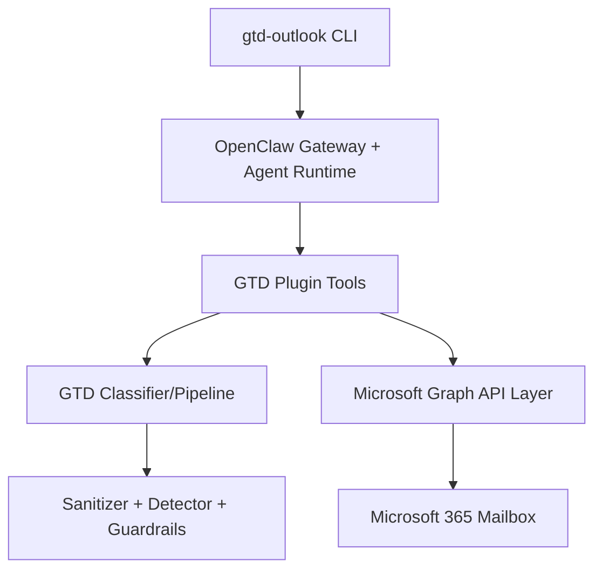

# Production Handoff Runbook

Date: 2026-05-13
Repository: `luizgama/gtd-for-outlook`

This runbook covers end-to-end installation, OpenClaw agent/plugin setup, project configuration, execution, and real inbox validation.

## 1) Preconditions

- Node.js 22+
- OpenClaw CLI installed and authenticated
- Microsoft 365 mailbox account
- Azure App Registration with delegated `Mail.ReadWrite`

Verify local runtime:

```bash
node -v
openclaw --version
```

## 2) Clone, install, and build

```bash
git clone git@github.com:luizgama/gtd-for-outlook.git
cd gtd-for-outlook
npm ci
npm run build
```

## 3) Configure Microsoft Graph

Follow `docs/microsoft-graph-setup.md` to configure Azure.

Required outcomes:

- App registration exists.
- Public client flow is enabled.
- Delegated permission `Mail.ReadWrite` is granted/consented.
- `GRAPH_CLIENT_ID` and `GRAPH_TENANT_ID` are available.

## 4) Configure local project credentials

```bash
cp .env.example .env
```

Set:

- `GRAPH_CLIENT_ID=<client-id>`
- `GRAPH_TENANT_ID=<tenant-id-or-common>`

Enable Graph API request logging (optional, for debugging):

```bash
export LOG_GRAPH_API_TO_FILE=true
export LOG_GRAPH_API_FILE_PATH=/tmp/gtd-for-outlook/graph-api.log
```

Then run setup:

```bash
node dist/index.js setup
```

Expected output: credentials/config saved to the local app config path.

## 5) Install/enable OpenClaw plugin and tools

Use the plugin directory containing `src/plugin/openclaw.plugin.json`.

Refresh and inspect:

```bash
openclaw plugins registry --refresh --json
openclaw plugins inspect gtd-outlook --json --runtime
```

Expected runtime indicators:

- `status` is loaded.
- `toolNames` includes:
  - `gtd_fetch_emails`
  - `gtd_classify_email`
  - `gtd_organize_email`
  - `gtd_sanitize_content`
  - `gtd_weekly_review`

If the runtime entry is missing, run:

```bash
npm run build
```

The bridge at `src/plugin/index.js` is expected to fail with that actionable instruction when dist is missing.

## 6) Configure tool allow-list for agent execution

Enable `llm-task` and include GTD tools plus `llm-task` via `tools.alsoAllow` for the active profile.

Validation:

```bash
openclaw gateway call tools.catalog --json --params '{"agentId":"main"}'
openclaw gateway call tools.effective --json --params '{"agentId":"main","sessionKey":"agent:main:main"}'
```

## 7) Run the process command

```bash
node dist/index.js process --agent
```

Or with custom options:

```bash
node dist/index.js process --batch-size 100 --max-emails 500 --since 2026-05-01
```

## 8) Verify email processing

Check that emails are being organized into GTD folders and categories are applied.

Use the log file if logging is enabled:

```bash
tail -f /tmp/gtd-for-outlook/graph-api.log
```

## 9) Scheduling (optional)

Set up auto-processing:

```bash
node dist/index.js schedule --every 30m
```

## 10) Troubleshooting

- Check OpenClaw logs: `openclaw logs`
- Inspect Graph API errors in log file if logging enabled
- Verify Azure permissions with: `az ad app show --id <client-id>`

See `docs/BACKLOG.md` for the full task list and `docs/plan.md` for the implementation plan.

## Status

**Production handoff ready (pre-tag)** — core security/GTD/pipeline/plugin/CLI modules are implemented and test-covered, with release validation and operator runbooks prepared. Remaining release action is final tag publication.

See [`docs/BACKLOG.md`](docs/BACKLOG.md) for the full task list and [`docs/plan.md`](docs/plan.md) for the implementation plan.

## Production Handoff

For production installation, OpenClaw setup, and real inbox validation, use:

- [docs/PRODUCTION_HANDOFF_RUNBOOK.md](docs/PRODUCTION_HANDOFF_RUNBOOK.md)
- [docs/RELEASE_HANDOFF_V0.1.0.md](docs/RELEASE_HANDOFF_V0.1.0.md)
- [docs/openclaw-agent-reference.md](docs/openclaw-agent-reference.md)

## Prerequisites

- Node.js 22+
- A Microsoft 365 account
- An Azure App Registration with `Mail.ReadWrite` permissions

## Quick Start

```bash
# Clone and install
git clone https://github.com/luizgama/gtd-for-outlook.git
cd gtd-for-outlook
npm ci

# Configure Azure credentials
gtd-outlook setup

# Process emails
gtd-outlook process --agent
```

## Architecture

See [docs/ARCHITECTURE.md](docs/ARCHITECTURE.md) and [docs/plan.md](docs/plan.md) for detailed architecture documentation.



## Security

Email content is treated as **untrusted input** that may contain prompt injection attacks in any language. The system uses a 6-layer defense strategy:

1. **Input validation** — strict schema enforcement on all tool parameters
2. **Prompt injection detection** — multi-stage sanitizer pipeline
3. **Category restriction** — only GTD-approved categories allowed
4. **Action gating** — no move operations without validated classification
5. **State checkpointing** — idempotent processing prevents duplicate actions
6. **Audit logging** — request/response tracing for security review

For detailed threat modeling and mitigations, see [`docs/THREAT_MODEL.md`](docs/THREAT_MODEL.md).

## GTD Folder Structure

The plugin creates these folders in your inbox:

- `@Action` — items requiring immediate attention
- `@WaitingFor` — tasks waiting on others
- `@SomedayMaybe` — deferrable ideas and research
- `@Reference` — informational material
- `Archive` — completed or inactive items

Each folder has a corresponding Outlook category label (e.g., "GTD: Action").

## Token caching

Authenticate once, then run unattended using the classification cache.

## Status

**Production handoff ready (pre-tag)** — core security/GTD/pipeline/plugin/CLI modules are implemented and test-covered, with release validation and operator runbooks prepared. Remaining release action is final tag publication.

See [`docs/BACKLOG.md`](docs/BACKLOG.md) for the full task list and [`docs/plan.md`](docs/plan.md) for the implementation plan.

## Production Handoff

For production installation, OpenClaw setup, and real inbox validation, use:

- [docs/PRODUCTION_HANDOFF_RUNBOOK.md](docs/PRODUCTION_HANDOFF_RUNBOOK.md)
- [docs/RELEASE_HANDOFF_V0.1.0.md](docs/RELEASE_HANDOFF_V0.1.0.md)
- [docs/openclaw-agent-reference.md](docs/openclaw-agent-reference.md)

## Prerequisites

- Node.js 22+
- A Microsoft 365 account
- An Azure App Registration with `Mail.ReadWrite` permissions

## Quick Start

```bash
# Clone and install
git clone https://github.com/luizgama/gtd-for-outlook.git
cd gtd-for-outlook
npm ci

# Configure Azure credentials
gtd-outlook setup

# Process emails
gtd-outlook process --agent
```

## Architecture

See [docs/ARCHITECTURE.md](docs/ARCHITECTURE.md) and [docs/plan.md](docs/plan.md) for detailed architecture documentation.


## Security

Email content is treated as **untrusted input** that may contain prompt injection attacks in any language. The system uses a 6-layer defense strategy:

1. **Input validation** — strict schema enforcement on all tool parameters
2. **Prompt injection detection** — multi-stage sanitizer pipeline
3. **Category restriction** — only GTD-approved categories allowed
4. **Action gating** — no move operations without validated classification
5. **State checkpointing** — idempotent processing prevents duplicate actions
6. **Audit logging** — request/response tracing for security review

For detailed threat modeling and mitigations, see [`docs/THREAT_MODEL.md`](docs/THREAT_MODEL.md).

## GTD Folder Structure

The plugin creates these folders in your inbox:

- `@Action` — items requiring immediate attention
- `@WaitingFor` — tasks waiting on others
- `@SomedayMaybe` — deferrable ideas and research
- `@Reference` — informational material
- `Archive` — completed or inactive items

Each folder has a corresponding Outlook category label (e.g., "GTD: Action").

## Token caching

Authenticate once, then run unattended using the classification cache.

## OpenClaw Platform Phase

This plugin targets production readiness for OpenClaw's `llm-task` boundary through v2 of the platform. For production runtime, this phase targets `gpt-5` through the OpenClaw `llm-task` boundary.

## OpenClaw inside Docker Sandbox

Docker Sandboxes run AI coding agents in isolated microVM sandboxes. Each sandbox gets its own Docker daemon, filesystem, and network — the agent can build containers, install packages, and modify files without touching your host system.

See [https://docs.docker.com/ai/sandboxes/](https://docs.docker.com/ai/sandboxes/) to learn more

## Contributing

See [docs/CONTRIBUTING.md](docs/CONTRIBUTING.md) for development guidelines.

## License

MIT - see [LICENSE](LICENSE)
